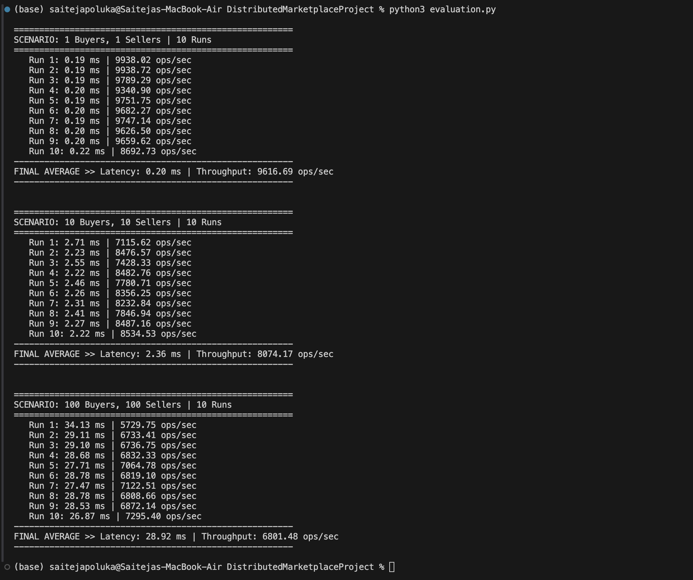

# Performance Report

## How I Tested It

I ran these tests on my MacBook Air (M-Series chip). Since I don't have multiple computers, I ran everything on `localhost` (my own machine) to simulate the network.

I wrote a script called `evaluation.py` that automatically launches buyers and sellers at the same time. Each buyer or seller logs in and does 1,000 operations (like searching for items or checking ratings).

I measured two things:

1. **Response Time:** How long it takes for the server to reply after I send a message.
2. **Throughput:** How many requests the server can finish in one second.

## My Results

I ran each test 10 times and took the average. Here is what I found:

## What Does This Mean?

### Scenario 1: Just 2 Users (1 Buyer, 1 Seller)

This was obviously the fastest. The response time was super low (0.20 ms) because the computer didn't have to multitask. There was no waiting in line for the database. Also, because I used persistent connections (keeping the pipe open), the system didn't waste time reconnecting over and over. **The throughput was huge (over 9,600 ops/sec) because the server could dedicate 100% of its power to just these two clients.**

### Scenario 2: 20 Users (10 Buyers, 10 Sellers)

The response time went up a little bit to 2.36 ms, and the **throughput dropped to ~8,074 ops/sec**. This happened because my computer had to start switching back and forth between 20 different threads (context switching). Even though 20 users isn't a lot, the "overhead" of managing them and making them wait for the database lock slowed the total speed down slightly compared to the single-user test.

### Scenario 3: 200 Users (100 Buyers, 100 Sellers)

The response time jumped to about 29 ms. This makes sense because when 200 people ask for something at once, a line forms, and requests have to wait their turn.

In this test, the **Throughput dropped further to ~6,800 ops/sec**. This happened because the system was under heavy stress. With 200 active threads, they started "fighting" over the database lock. The computer spent more time managing the traffic and waiting for the lock to open than actually processing the requests, which caused the overall speed to slow down.

## Conclusion

Overall, the system works well. It successfully handled 200 concurrent users without crashing. Although the speed slowed down a bit under maximum load (which is expected due to lock contention), it still processed over 6,800 operations per second, proving that the multi-threaded design is stable.
