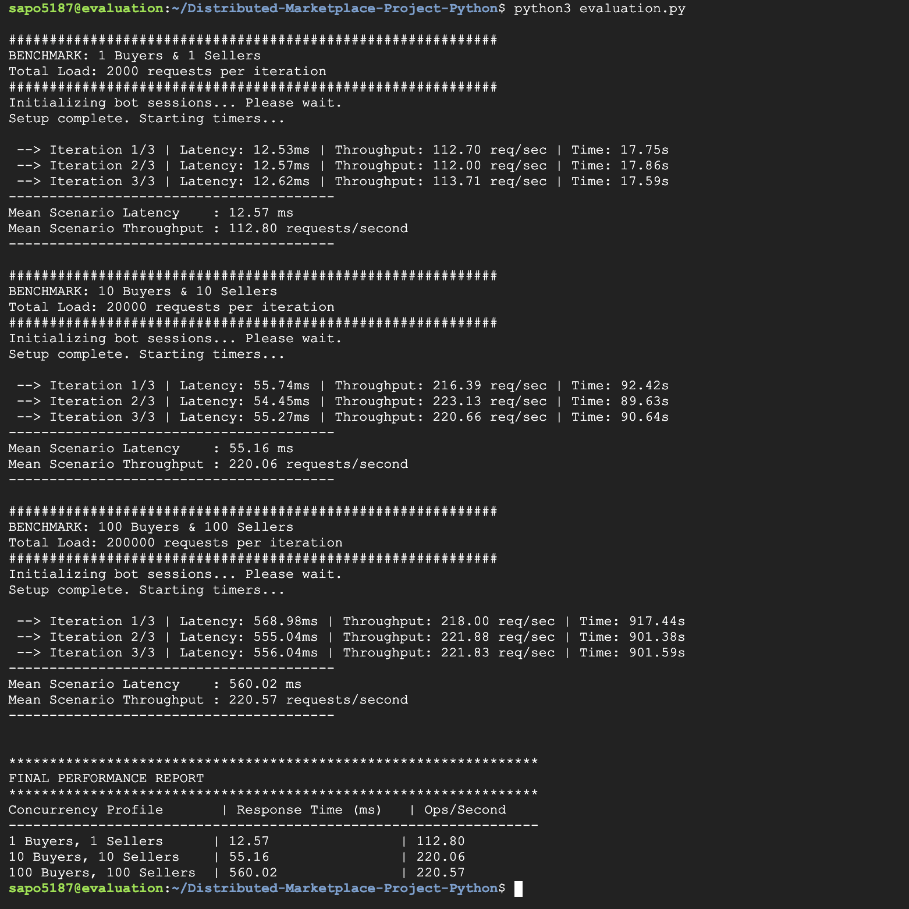

## **Performance Report: PA2 (Google Cloud Deployment)**

### **Experiment Setup**

For this evaluation, I deployed the system across four separate **Google Cloud Platform (GCP)** Virtual Machines. Each component (Customer DB, Product DB, Buyer Server, and Seller Server) ran on its own unique VM to ensure a truly distributed environment.

I ran the evaluation using a 5th "testing" VM located in the same GCP data center to simulate high-volume traffic. To measure performance, I conducted 3 runs for each scenario, where every client performed 1,000 API operations.

### **Performance Results**

### **Observations and Insights**

- **Scenario 1:** The latency was very low (12.57 ms) because there was zero contention for resources. Since only two clients were active, the gRPC workers and the SQLite database could handle every request immediately.
- **Scenario 2:** As we increased to 20 concurrent users, the throughput doubled to 220 ops/sec. This shows the system successfully used the multi-core CPU of the VMs to process more requests in parallel. The latency increased slightly because the OS had to manage more threads.
- **Scenario 3:** At 200 concurrent users, the throughput hit a peaked at 220 ops/sec. This indicates the system reached the maximum hardware capacity of the GCP instances. However, because I implemented **gRPC stream limits (200)** and **SQLite WAL mode**, the system stayed stable and did not crash under the heavy load.

### **Comparison: PA1 vs. PA2**

In **PA1**, I ran everything on `localhost` (my own MacBook), where latency was nearly zero (under 1ms) because there was no network delay.

In **PA2**, the latency is higher (~12ms to 560ms) because the data has to travel over real virtual networks between different VMs. However, PA2 is much more reliable. While PA1 suffered from "Broken Pipe" errors under high load, PA2 uses **gRPC's HTTP/2 multiplexing**, which handles hundreds of simultaneous requests over a single connection without failing.
